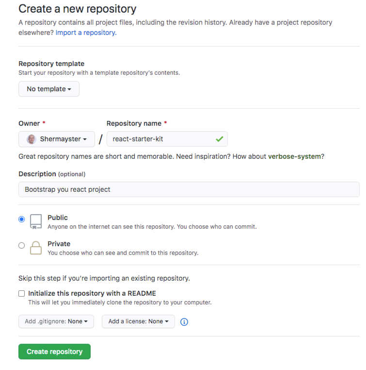

!🔴 work in progress 🔴!
Why?

In this guild you will learn how configure parcel, eslint, typescript and jest for you brand new project.

# Git

let's start from creating a repository for our project. I will call it react-starter-kit:

Now let's create a local folder with the project:

`mkdir react-starter-kit`

`cd react-starter-kit`
